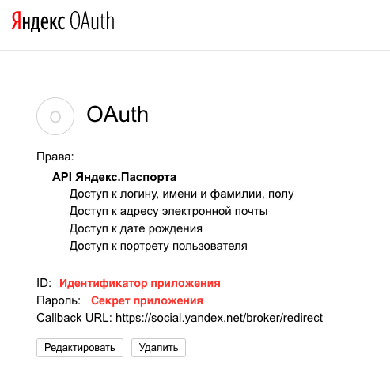
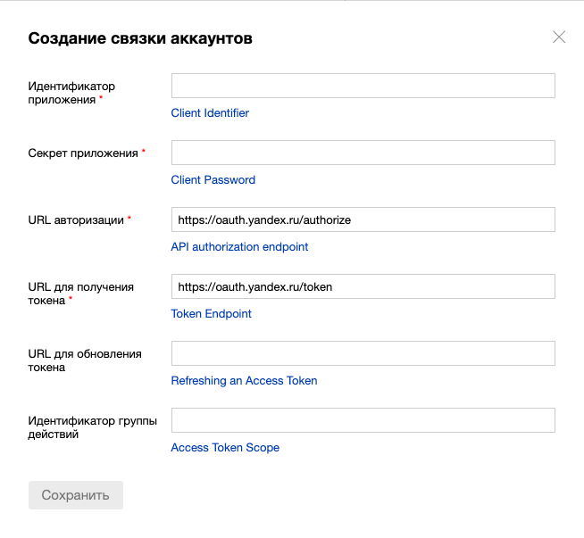

Инструкция связка аккаунтов Яндекс.Алиса и Яндекс.Паспорта (OAuth2)
--------

> Связка аккаунтов позволяет вашему навыку получить доступ к защищенным данным пользователя на стороннем сервисе, или авторизовать пользователя в вашем навыке. Особенно это актуально для навыка "Умный Дом".

* Заходим на [oauth.yandex.ru](https://oauth.yandex.ru/), нажимаем кнопку "Зарегистрировать новое приложение"
* В открывшемся окне вводим/выбираем обязательные поля:
    * Название приложения (какое угодно)
    * Платформы (выбираем "Веб-сервисы")
        * В поле Callback URI вставляем `https://social.yandex.net/broker/redirect` или свой адрес
    * Доступы (API Яндекс.Паспорта)
* Нажимаем "Сохранить" и попадаем на страницу с данными OAuth2-приложения (см. ниже)

* Копируем полученные хэши (ID и Пароль)
* На странице связки аккаунтов вставляем:
    * В поле "Идентификатор приложения" значение `ID` (со страницы вашего приложения на oauth.yandex.ru)
    * В поле "Секрет приложения" значение `Пароль` (со страницы вашего приложения на oauth.yandex.ru)
    * В поле "URL авторизации" значение `https://oauth.yandex.ru/authorize`
    * В поле "URL для получения токена" значение `https://oauth.yandex.ru/token`
    

[Вернуться в содержание](README.md)
